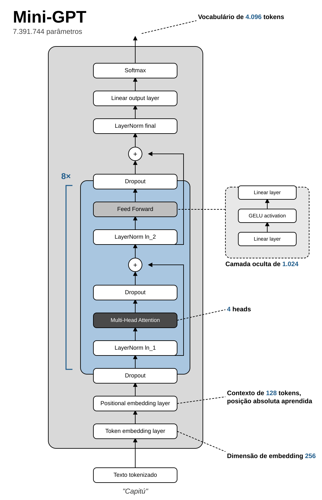

# Mini-GPT

<!-- screenshot/demo aqui -->

Um GPT decoder-only implementado do zero em PyTorch — sem `nn.Transformer`, sem atalhos — para
entender exatamente o que acontece dentro de um modelo de linguagem quando ele recebe uma frase.
Cada componente (tokenizer, attention, feed-forward, training loop, checkpoints, suporte a
GPU...) foi construído, testado e documentado separadamente, com a matemática explicada passo a
passo e números reais medidos no próprio modelo. Treina em CPU, CUDA ou MPS (GPU da Apple), sobre
um corpus em português: quatro romances de Machado de Assis (domínio público) mais um recorte da
Wikipedia em português.

```
$ uv run python inference.py "Capitú"
Capitú de Santos, os olhos de todos os a outros, e de da mulher. A senhora foi a que tinha a
vontade, entre os filhos, o pae, e as delle, a principio das mulheres, a pouco amanhães e a alma
do logar, e o pae o logar que viesse a ser fechado no sonho da vida, que viera ao sangue...
```

## Arquitetura



A visão de ponta a ponta, com os shapes de cada etapa e um diagrama Mermaid navegável, está em
[docs/architecture.md](docs/architecture.md). Para entender as letras e símbolos das fórmulas,
comece por [docs/00-notacao.md](docs/00-notacao.md). Cada componente tem seu próprio documento em
`docs/`, listados na seção [Componentes](#componentes) abaixo.

## Setup

Requer [uv](https://docs.astral.sh/uv/). O projeto fixa Python 3.12 (`.python-version`).

```bash
uv sync                  # cria .venv e instala as dependências
uv run python train.py   # treinamento (minutos a horas, depende do corpus e do device), salva checkpoints/
uv run pytest            # testes
uv run ruff check .      # lint
uv run ruff format .     # formatação
```

Um checkpoint já treinado (BPE, corpus atual) vem em `checkpoints/best.pt` e `checkpoints/latest.pt`
— `inference.py` funciona direto, sem precisar treinar primeiro.

Cada componente tem um experimento em `experiments/`, rodado como módulo:

```bash
uv run python -m experiments.e01_tokenizer
uv run python -m experiments.e02_dataset
uv run python -m experiments.e03_embeddings
uv run python -m experiments.e04_attention
uv run python -m experiments.e05_multi_head_attention
uv run python -m experiments.e06_feed_forward
uv run python -m experiments.e07_transformer_block
uv run python -m experiments.e08_gpt
uv run python -m experiments.e09_lm_head
uv run python -m experiments.e10_loss
uv run python -m experiments.e11_training
uv run python -m experiments.e12_overfit
uv run python -m experiments.e13_generation   # precisa do modelo salvo pelo train.py
uv run python -m experiments.e14_evaluation   # precisa do modelo e do histórico do train.py
uv run python -m experiments.e15_checkpoints  # precisa dos checkpoints do train.py
uv run python -m experiments.e16_gpu          # mais completo com os checkpoints do train.py
uv run python -m experiments.e17_performance  # attention eficiente (SDPA) e mixed precision
uv run python -m experiments.e18_bpe_tokenizer  # tokenizer BPE: merges, compressão, round-trip
```

O treino salva em `checkpoints/`: `latest.pt` (a cada época), `best.pt` (menor loss de validação),
`checkpoint_<passo>.pt` (a cada 1000 passos) e `history.json`. Todos servem para gerar texto e para
continuar o treino:

```bash
uv run python inference.py "Capitú"
uv run python inference.py "o gato" --temperature 0.5 --seed 1 --checkpoint checkpoints/best.pt
uv run python train.py --resume checkpoints/latest.pt              # continua de onde parou
uv run python train.py --resume checkpoints/latest.pt --epochs 40  # treina mais épocas
uv run python train.py --device cpu                                # força CPU (padrão: auto)
```

O corpus de treino (`configs/tiny.yaml`: `corpus/machado_e_wikipedia.txt`) combina dois textos, já
prontos no repositório:

```bash
uv run python scripts/prepare_corpus.py                              # 4 romances de Machado de Assis (Project Gutenberg)
uv run --group data python scripts/prepare_wikipedia_corpus.py       # recorte da Wikipedia em português
```

`requirements.txt` é gerado a partir do `uv.lock` para quem preferir pip:

```bash
uv export --no-dev --no-hashes --format requirements-txt -o requirements.txt
```

## Estrutura

```text
config.py            dataclasses da configuração + load_config()
configs/tiny.yaml    configuração inicial (d_model=256, 4 heads, 8 layers)
corpus/              texto de treino (4 romances de Machado de Assis + recorte da Wikipedia, limpos)
scripts/             download e limpeza do corpus
tokenizer/           texto <-> IDs (BPE por padrão; tokenizer por caractere como referência)
data/                janelas (x, y), split treino/validação, DataLoaders
model/               embeddings, attention, feed-forward, blocks, GPT, LM head
training/            loss, training loop, métricas, checkpoints
generation/          geração autoregressiva e sampling
tests/               um arquivo de teste por componente
experiments/         um experimento por componente (validação prática)
docs/                documentação de cada componente
train.py             ponto de entrada do treinamento
inference.py         ponto de entrada da geração
```

## Componentes

- [x] Tokenizer ([docs](docs/01-tokenizer.md))
- [x] Dataset ([docs](docs/02-dataset.md))
- [x] Embeddings ([docs](docs/03-embeddings.md))
- [x] Scaled Dot-Product Attention ([docs](docs/04-attention.md))
- [x] Multi-Head Attention ([docs](docs/05-multi-head-attention.md))
- [x] Feed Forward Network ([docs](docs/06-feed-forward.md))
- [x] Transformer Block ([docs](docs/07-transformer-block.md))
- [x] GPT Model ([docs](docs/08-gpt.md))
- [x] Language Model Head ([docs](docs/09-lm-head.md))
- [x] Loss ([docs](docs/10-loss.md))
- [x] Training Loop ([docs](docs/11-training.md))
- [x] Overfitting proposital ([docs](docs/12-overfitting.md))
- [x] Text Generation ([docs](docs/13-generation.md))
- [x] Avaliação ([docs](docs/14-evaluation.md))
- [x] Checkpoints ([docs](docs/15-checkpoints.md))
- [x] GPU ([docs](docs/16-gpu.md))
- [x] Performance ([docs](docs/17-performance.md)) — attention eficiente (SDPA) e mixed precision; KV cache, gradient accumulation, batching, `torch.compile` e otimização de memória ficam para depois
- [x] Tokenizer BPE ([docs](docs/18-bpe-tokenizer.md)) — subpalavras aprendidas por frequência, em vez de um token por caractere; comprime ~2,1x e evita geração cortando palavras no meio

## Licença

[MIT](LICENSE).
