# Arquitetura do Mini-GPT

Visão de ponta a ponta: o caminho de um texto até a loss, com o shape de cada tensor.
Cada componente tem um documento próprio com a matemática e as decisões de projeto; este
arquivo conecta as partes e é atualizado conforme o projeto evolui.

Guia de notação: [00-notacao.md](00-notacao.md). Lista de componentes: [README.md](../README.md).

---

## Para que serve este documento

Os documentos de cada componente (`01-tokenizer.md` a `09-lm-head.md`) explicam **uma peça por
vez**, em profundidade: matemática, experimentos, testes. Este documento é o **mapa geral**: mostra
**como as peças se encaixam**.

Aqui você encontra:

- a ordem em que os dados atravessam o modelo e o shape de cada tensor;
- o objetivo de cada etapa, em uma ou duas frases;
- quantos parâmetros cada parte tem, e de onde vem cada número;
- as decisões de projeto tomadas até agora, com links para o documento que as justifica.

**Como usar:**

1. Antes de estudar um componente, localize a peça no [fluxo de dados](#fluxo-de-dados): o que
   entra, o que sai, o que vem antes e depois.
2. Abra o documento do componente (coluna "doc" das tabelas) para os detalhes.
3. Se aparecer um símbolo desconhecido, consulte a [tabela de notação](#notação) abaixo e o
   [00-notacao.md](00-notacao.md), que explica cada operação com exemplos.
4. Depois de estudar cada componente, volte aqui para ver o que mudou no todo.

### Status

| componente | status | doc |
|---|---|---|
| tokenizer | ✅ concluído | [01](01-tokenizer.md) |
| dataset e batches | ✅ concluído | [02](02-dataset.md) |
| embeddings | ✅ concluído | [03](03-embeddings.md) |
| self-attention causal | ✅ concluído | [04](04-attention.md) |
| multi-head attention | ✅ concluído | [05](05-multi-head-attention.md) |
| feed-forward | ✅ concluído | [06](06-feed-forward.md) |
| Transformer block (LayerNorm, residual) | ✅ concluído | [07](07-transformer-block.md) |
| GPT (blocos empilhados, LayerNorm final) | ✅ concluído | [08](08-gpt.md) |
| LM head e weight tying | ✅ concluído | [09](09-lm-head.md) |
| loss (`cross_entropy`) | ✅ | [10](10-loss.md) |
| training loop (AdamW, clipping, warmup, avaliação por época) | ✅ | [11](11-training.md) |
| overfitting proposital (prova de sanidade do pipeline) | ✅ | [12](12-overfitting.md) |
| geração (greedy, temperature, top-k, top-p) e salvamento simples do modelo | ✅ | [13](13-generation.md) |
| avaliação: métricas, histórico, análise de erros, calibração, attention, memória | ✅ | [14](14-evaluation.md) |
| checkpoints completos: retomar o treino exatamente, melhor época, salvamento atômico | ✅ | [15](15-checkpoints.md) |
| suporte a GPU (CUDA/MPS), reprodutibilidade entre devices | ✅ | [16](16-gpu.md) |
| performance: attention eficiente (SDPA) e mixed precision | ✅ | [17](17-performance.md) |

**Onde o projeto está.** O pipeline roda em CPU, CUDA ou MPS: tokenizer → janelas → GPT com
**6.371.840 parâmetros** (`tiny.yaml`: 8 blocos, `d_model` 256) → loss → treino → avaliação →
geração, treinado sobre 4 romances de Machado de Assis. Um treino de 60 épocas leva a melhor loss
de validação a 1,222 (perplexidade 3,39) já na época 34 — depois disso o modelo só decora o treino
([12-overfitting.md](12-overfitting.md)), e `best.pt` fica travado nessa época automaticamente. Os
checkpoints servem tanto para gerar texto quanto para continuar o treino do ponto exato em que
parou.

---

## Diagrama da arquitetura

O mesmo [fluxo de dados](#fluxo-de-dados) de baixo, como um grafo: cada caixa é uma operação, cada
seta carrega um tensor. O bloco tracejado se repete $L = 8$ vezes, sempre com os mesmos dois
padrões — `LayerNorm` lendo o residual stream, a subcamada escrevendo, a escrita **somada** de
volta (não substituindo nada). É o mesmo grafo para treino e para geração; os dois só divergem no
final, depois dos logits.

```mermaid
flowchart TD
    text["Texto bruto<br/>4 romances de Machado de Assis"] -->|"CharTokenizer.encode<br/>(01-tokenizer.md)"| ids["IDs — [N]<br/>N = 1.435.884 no treino"]
    ids -->|"janelas deslizantes<br/>(02-dataset.md)"| xy["x, y — [B, T]<br/>[30, 128]"]

    subgraph emb["Embeddings — 03-embeddings.md"]
        direction LR
        tokemb["Token Embedding E<br/>[V, d] = [112, 256]"]
        posemb["Position Embedding P<br/>[T, d] = [128, 256]"]
        somaemb((" + "))
        tokemb --> somaemb
        posemb --> somaemb
    end
    xy --> emb
    emb -->|"h⁽⁰⁾"| h0["[B, T, d] = [30, 128, 256]"]

    subgraph block["Transformer Block × L = 8 — 07-transformer-block.md"]
        direction TB
        hin(["h : entrada do bloco"])
        ln1["LayerNorm ln_1"]
        mha["Multi-Head Attention<br/>4 heads × d_h = 64<br/>(04-attention.md, 05-multi-head-attention.md)"]
        add1((" + residual "))
        ln2["LayerNorm ln_2"]
        ffn["Feed Forward<br/>256 → 1024 → 256, GELU<br/>(06-feed-forward.md)"]
        add2((" + residual "))
        hout(["h : saída do bloco"])

        hin --> ln1 --> mha --> add1
        hin --> add1
        add1 --> ln2 --> ffn --> add2
        add1 --> add2
        add2 --> hout
    end
    h0 --> block
    block -->|"h⁽⁸⁾"| hfinal["[B, T, d] = [30, 128, 256]"]

    hfinal --> lnfinal["LayerNorm final<br/>(08-gpt.md)"]
    lnfinal --> lmhead["LM Head<br/>[d, V], pesos = Eᵀ (weight tying)<br/>(09-lm-head.md)"]
    lmhead --> logits["logits — [B, T, V]<br/>[30, 128, 112]"]

    logits --> loss["cross_entropy(logits, y)<br/>(10-loss.md)"]
    loss --> lossval(["loss escalar<br/>AdamW minimiza — 11-training.md"])

    logits -.->|"na geração, só a<br/>última posição<br/>(13-generation.md)"| sample["softmax + temperature / top-k / top-p"]
    sample -.-> nexttoken(["próximo token<br/>concatenado ao contexto; o loop se repete"])

    classDef tensor fill:#eef2ff,stroke:#4f46e5,color:#1e1b4b
    classDef op fill:#ecfdf5,stroke:#059669,color:#022c22
    classDef scalar fill:#fef3c7,stroke:#b45309,color:#451a03
    class text,ids,xy,h0,hfinal,logits tensor
    class tokemb,posemb,somaemb,ln1,mha,add1,ln2,ffn,add2,lnfinal,lmhead,loss,sample tensor
    class hin,hout op
    class lossval,nexttoken scalar
```



**Como ler:** setas cheias são o caminho normal (embeddings → blocos → LM head → logits); setas
tracejadas marcam onde a geração diverge do treino — em vez de comparar os logits com `y` e
calcular a loss, a geração olha só a última posição, sorteia um token e concatena de volta em
`ids`, repetindo o ciclo (`generate`, [13-generation.md](13-generation.md)). Cada caixa com um
nome de arquivo entre parênteses tem seu próprio documento — a matemática completa de cada uma não
está aqui, só o formato que entra e sai.

---

## Notação

| símbolo | como se lê | significado | `tiny.yaml` |
|---|---|---|---:|
| $N$ | "ene" | tokens no corpus de treino | 1.435.884 |
| $B$ | "bê" | `batch_size` | 30 |
| $T$ | "tê" | `context_length` | 128 |
| $V$ | "vê" | `vocab_size` (definido pelo tokenizer) | 112 |
| $d$ | "dê" | `d_model` | 256 |
| $h$ | "agá" | `num_heads` | 4 |
| $d_h$ | "dê agá" | `head_dim` $= d / h$ | 64 |
| $L$ | "ele" | `num_layers` | 8 |
| $d_{ff}$ | "dê éfe éfe" | dimensão interna do feed-forward $= 4d$ | 1.024 |

**Cada letra em palavras:**

- **$N$**: quantos tokens (aqui, caracteres) existem no texto de treino: os primeiros 90% dos 4
  romances.
- **$B$**: quantas sequências o modelo processa juntas num passo de treino.
- **$T$**: quantos tokens cada sequência tem. É também o maior contexto que o modelo enxerga:
  128 caracteres, cerca de 23 palavras.
- **$V$**: quantos tokens diferentes existem: 108 caracteres do corpus mais 4 tokens especiais.
  Não fica no YAML porque depende do corpus, não da arquitetura.
- **$d$**: quantos números tem cada vetor que atravessa o modelo. É a "largura" do residual
  stream.
- **$h$**: quantas heads de attention rodam em paralelo dentro de cada bloco.
- **$d_h$**: quantos números cada head usa. As $h$ heads juntas somam $d$: $4 \times 64 = 256$.
- **$L$**: quantos blocos Transformer são empilhados.
- **$d_{ff}$**: quantos neurônios tem a camada interna do feed-forward.

**Atenção à letra $h$.** Na tabela, $h$ é o **número de heads**. No fluxo de dados e na fórmula
do residual stream, $h^{(\ell)}$ (com um índice entre parênteses) é outra coisa: o **vetor** do
residual stream depois do bloco $\ell$. O guia [00-notacao.md](00-notacao.md) (seção 3) lista
essas letras reaproveitadas.

### Outros símbolos deste documento

| símbolo | como se lê | significado | shape ou valor no `tiny.yaml` |
|---|---|---|---|
| $x$, $y$ | "xis", "ípsilon" | IDs de entrada e alvos; $y$ é $x$ deslocado uma posição (o próximo token) | `[B, T]` = `[30, 128]` |
| $E$ | "é" | matriz do token embedding: uma linha por token | `[V, d]` = `[112, 256]` |
| $P$ | "pê" | matriz do positional embedding: uma linha por posição | `[T, d]` = `[128, 256]` |
| $E[x]$ | "E indexado por x" | troca cada ID pela sua linha de $E$ | `[B, T, d]` |
| $P[0..T-1]$ | "P de 0 a T menos 1" | as linhas das posições 0 a $T-1$ | `[T, d]` |
| $h^{(\ell)}$, `h⁽ℓ⁾` | "agá ele" | residual stream depois do bloco $\ell$; o índice entre parênteses **não** é potência. $h^{(0)}$ é a saída dos embeddings | `[B, T, d]` |
| $\ell$ | "ele" cursivo | número do bloco | 1 a 8 |
| $\text{LN}$ | "LayerNorm" | normaliza cada vetor (média 0, variância 1) e aplica $\gamma$ e $\beta$ | `[B, T, d]` → `[B, T, d]` |
| $\text{MHA}$ | "multi-head attention" | a attention com $h$ heads e projeção de saída | `[B, T, d]` → `[B, T, d]` |
| $\text{FFN}$ | "feed-forward network" | a rede de duas camadas aplicada a cada posição | `[B, T, d]` → `[B, T, d]` |
| $\leftarrow$ | "passa a valer" | atribuição: o valor da direita substitui o da esquerda | |
| $\gamma$, $\beta$ | "gama", "beta" | escala e deslocamento aprendidos de cada LayerNorm | $d$ = 256 números cada |
| $W_Q$, $W_K$, $W_V$, $W_O$ | "dáblio quê", "kê", "vê", "ó" | projeções da attention: queries, keys, values e saída | `[d, d]` cada, juntando as heads |
| $W_1$, $b_1$, $W_2$, $b_2$ | "dáblio um", "bê um"… | pesos e biases do feed-forward | `[1024, 256]`, `[1024]`, `[256, 1024]`, `[256]` |
| $\mathcal{N}(0, 0{,}02^2)$ | "normal de média 0 e desvio 0,02" | sorteio usado para inicializar os pesos | |
| $-\infty$ | "menos infinito" | valor que a máscara causal soma aos scores do futuro | |
| $\mathcal{L}$ | "ele cursivo", "a loss" | o erro de previsão que o treino vai diminuir ([10-loss.md](10-loss.md)) | um número |

---

## Fluxo de dados

```text
                                                                shape            doc
texto (str)
  │  CharTokenizer.encode                                       [N]              01
  ▼
ids ── split contíguo, janelas deslizantes, DataLoader
  │                                                             x, y: [B, T]     02
  ▼
Embeddings:  h⁽⁰⁾ = E[x] + P[0..T-1]                            [B, T, d]        03
  │
  ▼  ┌─ Transformer Block (× L) ─────────────────────────┐
     │  h = h + MultiHeadAttention(LayerNorm(h))        │      [B, T, d]        04, 05, 07
     │  h = h + FeedForward(LayerNorm(h))               │      [B, T, d]        06, 07
     └──────────────────────────────────────────────────┘
  │
  ▼  LayerNorm final                                            [B, T, d]        08
  ▼  LM head: Linear(d → V)                                     [B, T, V]        09
  ▼  cross_entropy(logits, y)                                   escalar          10
```

Nas duas linhas do bloco, `h` é o residual stream (um tensor), não o número de heads.

### O que cada etapa faz

| etapa | objetivo | shape no `tiny.yaml` | doc |
|---|---|---|---|
| **texto** | a matéria-prima: 4 romances de Machado de Assis, limpos e normalizados. O modelo aprende a continuar esse texto. | `str` com 1.595.426 caracteres | [02](02-dataset.md) |
| **tokenizer** | troca cada caractere por um ID inteiro de 0 a 111, porque redes neurais só operam sobre números. | `[N]` = `[1.435.884]` no treino | [01](01-tokenizer.md) |
| **batches** | recorta os IDs em janelas; `x` é a janela e `y` é a mesma janela deslocada uma posição, ou seja, o próximo token de cada posição. Empilha $B$ janelas. | `x`, `y`: `[30, 128]` | [02](02-dataset.md) |
| **embeddings** | troca cada ID por um vetor aprendido de $d$ números e soma o vetor da posição: o modelo passa a saber **qual** caractere e **onde** ele está. | `[30, 128, 256]` | [03](03-embeddings.md) |
| **attention** | a única etapa que **move informação entre posições**: cada posição lê as anteriores (nunca as futuras, por causa da máscara causal) e traz o que for relevante. | `[30, 128, 256]`; por dentro, 4 heads `[30, 4, 128, 64]` | [04](04-attention.md), [05](05-multi-head-attention.md) |
| **feed-forward** | processa **cada posição sozinha**, com uma não-linearidade (GELU): combina a informação que a attention trouxe. | `[30, 128, 256]`; por dentro, 1.024 neurônios `[30, 128, 1024]` | [06](06-feed-forward.md) |
| **LayerNorm** | padroniza a escala de cada vetor (média 0, variância 1). Fica antes de cada subcamada (no bloco) e antes do LM head (a final), para que todos leiam entradas de tamanho estável. | `[30, 128, 256]` | [07](07-transformer-block.md), [08](08-gpt.md) |
| **LM head** | dá um score (**logit**) a cada um dos 112 tokens, em cada posição: o produto escalar entre o estado final e a linha daquele token. | `[30, 128, 112]` | [09](09-lm-head.md) |
| **loss** | compara os logits com `y`: média, nas 3.840 posições, de $-\log$ da probabilidade dada ao token correto (cross-entropy). É o número que o treino vai diminuir. | um escalar | [10](10-loss.md) |

Só três etapas mudam o "formato" dos dados: o tokenizer (texto → inteiros), os embeddings
(inteiros → vetores de $d$ números) e o LM head ($d$ números → $V$ scores). Entre os embeddings
e o LM head, o shape é sempre `[B, T, d]`.

Na geração ([13-generation.md](13-generation.md)), o mesmo caminho é percorrido sem `y`: usa-se só
o logit da última posição, `[B, V]`, para sortear o próximo token, que é concatenado à entrada.

---

## O residual stream

A partir dos embeddings, cada posição carrega um vetor de dimensão $d$ que atravessa o
modelo inteiro: o **residual stream**. Os blocos não substituem esse vetor; eles
**somam** algo a ele:

$$
h^{(\ell)} = h^{(\ell-1)} + \text{MHA}\big(\text{LN}(h^{(\ell-1)})\big), \qquad
h^{(\ell)} \leftarrow h^{(\ell)} + \text{FFN}\big(\text{LN}(h^{(\ell)})\big)
$$

**Lendo a fórmula:**

- $h^{(\ell-1)}$: o residual stream na entrada do bloco $\ell$, isto é, a saída do bloco
  anterior. $h^{(0)}$ é a saída dos embeddings. O índice entre parênteses é o número do bloco,
  não uma potência.
- $\text{LN}(h^{(\ell-1)})$: a LayerNorm produz uma versão **normalizada** do stream, só para a
  subcamada ler. O stream em si não é normalizado.
- $\text{MHA}(\dots)$: a attention lê essa versão normalizada e calcula o que escrever.
- $h^{(\ell-1)} + \text{MHA}(\dots)$: a escrita é **somada** ao stream. Essa soma é a **conexão
  residual**.
- Segunda equação: $\leftarrow$ significa "passa a valer". O feed-forward lê o stream **já
  atualizado** pela attention, e a sua escrita também é somada. É o mesmo que $x'$ e "saída" em
  [07-transformer-block.md](07-transformer-block.md).
- As duas $\text{LN}$ são módulos diferentes (`ln_1` e `ln_2`), cada um com os seus $\gamma$ e
  $\beta$. A fórmula usa o mesmo nome para os dois.
- **No código** ([`model/transformer_block.py`](../model/transformer_block.py), linhas 37–38):
  `x = x + self.attention(self.ln_1(x))` e `x = x + self.feed_forward(self.ln_2(x))`.
- **Desenrolando os $L$ blocos:** o stream final é $h^{(0)}$ mais a soma das $2L = 16$ escritas
  ([07-transformer-block.md](07-transformer-block.md), seção 3.1).
- **Com números** (inicialização, medido com `configs/tiny.yaml`): a norma média por posição é
  0,454 depois dos embeddings e cresce ~0,15 por bloco até 1,491 no fim do bloco 8. A LayerNorm
  final a leva para 15,99 ($\approx \sqrt{256} = 16$).

Três consequências guiam o resto do projeto:

- **$d$ é a largura de comunicação do modelo.** Tudo o que um bloco quer passar adiante
  precisa caber em $d$ dimensões por posição.
- **O shape não muda entre blocos** (`[B, T, d]`), por isso é possível empilhar $L$ blocos.
- **A soma cria um caminho direto para o gradiente**, da loss até os embeddings: ao longo do
  stream, do último bloco até $h^{(0)}$, o gradiente atravessa só somas, sem passar por nenhuma
  não-linearidade. É o que torna modelos profundos treináveis (medido em
  [07-transformer-block.md](07-transformer-block.md), seção 3.3).

A attention é a única operação que **mistura posições**: move informação entre tokens.
Feed-forward e LayerNorm atuam em cada posição isoladamente.

---

## Componentes

Cada linha é um módulo (ou função) do código. As colunas dizem o que ele recebe e devolve, o
seu papel e onde está explicado.

| componente | entrada → saída | papel | código | doc |
|---|---|---|---|---|
| Tokenizer | `str` → `[N]` | texto ↔ IDs, um por caractere | `tokenizer/` (`CharTokenizer`) | [01](01-tokenizer.md) |
| Dataset / DataLoader | `[N]` → `[B, T]`, `[B, T]` | pares (contexto, próximo token) | `data/dataset.py`, `data/loader.py` | [02](02-dataset.md) |
| Embeddings | `[B, T]` → `[B, T, d]` | ID → vetor, mais informação de posição | `model/embeddings.py` | [03](03-embeddings.md) |
| Self-attention causal (1 head) | `[B, T, d]` → `[B, T, d_h]` | cada posição lê as anteriores | `model/attention.py` (`CausalSelfAttention`) | [04](04-attention.md) |
| Multi-head attention | `[B, T, d]` → `[B, T, d]` | $h$ attentions em subespaços de $d_h$ dims | `model/attention.py` (`MultiHeadAttention`) | [05](05-multi-head-attention.md) |
| Feed-forward | `[B, T, d]` → `[B, T, d]` | processamento não linear por posição | `model/feed_forward.py` | [06](06-feed-forward.md) |
| LayerNorm | `[B, T, d]` → `[B, T, d]` | padroniza cada vetor; $\gamma$ e $\beta$ aprendidos | `model/layer_norm.py` | [07](07-transformer-block.md) |
| Transformer block | `[B, T, d]` → `[B, T, d]` | pre-norm + residual em volta de MHA e FFN | `model/transformer_block.py` | [07](07-transformer-block.md) |
| LM head | `[B, T, d]` → `[B, T, V]` | um logit por token do vocabulário; reusa a matriz do token embedding | `model/lm_head.py` | [09](09-lm-head.md) |
| GPT | `[B, T]` → `[B, T, V]` | embeddings, $L$ blocos, LayerNorm final, LM head; `hidden_states` devolve `[B, T, d]` | `model/gpt.py` | [08](08-gpt.md) |

Uma head sozinha ([04-attention.md](04-attention.md)) devolve `[B, T, d_h]` porque é uma peça
interna: a multi-head attention junta as $h$ saídas de $d_h$ números e projeta de volta para $d$
([05-multi-head-attention.md](05-multi-head-attention.md)).

---

## Orçamento de parâmetros

Todos os valores são exatos: todos os componentes do modelo já existem (embeddings ao LM head). A
contagem é conferida pelos testes (`test_parameter_count` em [08-gpt.md](08-gpt.md),
`test_tying_saves_vocab_size_times_d_model_parameters` em [09-lm-head.md](09-lm-head.md)) e pelos
experimentos de 07-transformer-block.md e 08-gpt.md. A attention não usa bias (decidido em
[04-attention.md](04-attention.md)); o feed-forward usa bias
([06-feed-forward.md](06-feed-forward.md)).

| parte | fórmula | com `tiny.yaml` | parâmetros |
|---|---|---|---:|
| token embedding | $V d$ | $112 \cdot 256$ | 28.672 |
| position embedding | $T d$ | $128 \cdot 256$ | 32.768 |
| attention, por bloco | $4d^2$ (Q, K, V e projeção de saída, sem bias) | $4 \cdot 256^2$ | 262.144 |
| feed-forward, por bloco | $d \cdot 4d + 4d + 4d \cdot d + d$ (com bias) | $262.144 + 1.024 + 262.144 + 256$ | 525.568 |
| 2 LayerNorms, por bloco | $2 \cdot 2d$ ($\gamma$ e $\beta$) | $4 \cdot 256$ | 1.024 |
| **$L = 8$ blocos** | $L(12d^2 + 9d)$ | $8 \cdot 788.736$ | **6.309.888** |
| LayerNorm final | $2d$ | $2 \cdot 256$ | 512 |
| LM head | 0 com weight tying (padrão); $Vd$ sem | 0 ou $112 \cdot 256$ | 0 (28.672 sem tying) |
| **total** (com weight tying) | $Vd + Td + L(12d^2 + 9d) + 2d$ | $28.672 + 32.768 + 6.309.888 + 512$ | **6.371.840** (6.400.512 sem tying) |

**Lendo as fórmulas:**

- **$Vd$** (token embedding): uma linha de $d = 256$ números para cada um dos $V = 112$ tokens.
- **$Td$** (position embedding): uma linha de 256 números para cada uma das $T = 128$ posições.
- **$4d^2$** (attention): quatro matrizes $d \times d$, uma para cada projeção ($W_Q$, $W_K$, $W_V$
  e $W_O$). Cada uma tem $256 \times 256 = 65.536$ números, e $4 \times 65.536 = 262.144$. As 4
  heads não acrescentam nada: dividem cada matriz em blocos de $d_h = 64$
  ([05-multi-head-attention.md](05-multi-head-attention.md)).
- **$d \cdot 4d + 4d + 4d \cdot d + d$** (feed-forward), termo a termo:
  - $d \cdot 4d$: $W_1$, que expande $256 \to 1.024$: $256 \times 1.024 = 262.144$;
  - $4d$: $b_1$, um bias por neurônio: 1.024;
  - $4d \cdot d$: $W_2$, que contrai $1.024 \to 256$: $262.144$;
  - $d$: $b_2$, um bias por coordenada da saída: 256;
  - somando: $8d^2 + 5d = 524.288 + 1.280 = 525.568$.
- **$2 \cdot 2d$** (LayerNorms do bloco): duas LayerNorms, cada uma com $\gamma$ e $\beta$ de $d$
  números: $4 \times 256 = 1.024$.
- **$12d^2 + 9d$** (um bloco): $4d^2 + (8d^2 + 5d) + 4d = 12d^2 + 9d$, ou seja,
  $786.432 + 2.304 = 788.736$.
- **$L(12d^2 + 9d)$**: $8 \times 788.736 = 6.309.888$.
- **$2d$** (LayerNorm final): $\gamma$ e $\beta$, $2 \times 256 = 512$.
- **LM head:** com weight tying, reusa a matriz $E$ do token embedding e não acrescenta nenhum
  parâmetro ([09-lm-head.md](09-lm-head.md)). Sem tying, teria a sua própria matriz $V \times d$.
- **Total:** $28.672 + 32.768 + 6.309.888 + 512 = 6.371.840$. Sem tying, $+\,28.672 = 6.400.512$.

Os blocos concentram ~99% dos parâmetros — mais que antes, porque $L$ dobrou (4 → 8) enquanto os
embeddings continuam dependendo só de $V$ e $T$ — e dentro de cada bloco o feed-forward continua
com o dobro da attention (essa razão não depende de $d$).

- Blocos: $6.309.888 / 6.371.840 = 99{,}0\%$. Embeddings: $61.440 / 6.371.840 = 1{,}0\%$.
- Feed-forward: $525.568 / 262.144 \approx 2{,}01$ vezes a attention, 66,6% de cada bloco.
- O termo $d^2$ domina: dobrar $d$ quase quadruplica os parâmetros dos blocos — é por isso que ir
  de $d{=}128$ para $d{=}256$ (mantendo $L{=}4$) levaria a bem menos que os 6,4 milhões atuais; o
  salto grande veio de **também** dobrar $L$.

---

## Decisões de projeto até aqui

Cada linha registra uma escolha, a principal alternativa descartada e o motivo. O link leva ao
documento em que a decisão é discutida, quase sempre com uma medição que a justifica.

| decisão | alternativa | motivo | doc |
|---|---|---|---|
| tokenizer por caracteres | palavras, BPE | vocabulário pequeno, sem `<UNK>` no corpus, treina na CPU | [01](01-tokenizer.md) |
| corpus: 4 romances de Machado de Assis | Tiny Shakespeare; só *Dom Casmurro* | português, domínio público; mais dados reduziu o gap validação−treino de +0,35 para +0,17 | [02](02-dataset.md) |
| split treino/validação contíguo | janelas sorteadas | evita vazamento entre janelas sobrepostas | [02](02-dataset.md) |
| positional embedding absoluto aprendido | sinusoidal, RoPE, ALiBi | o mais simples; fiel ao GPT-2 | [03](03-embeddings.md) |
| inicialização $\mathcal{N}(0, 0{,}02^2)$ | padrão do PyTorch | convenção do GPT-2; residual stream começa em escala pequena | [03](03-embeddings.md) |
| Q, K, V sem bias | com bias (GPT-2) | é exatamente a fórmula $Q = XW_Q$; padrão em modelos recentes (LLaMA) | [04](04-attention.md) |
| causal mask com $-\infty$ antes da softmax | zerar pesos depois da softmax | as linhas continuam somando 1 sem renormalizar | [04](04-attention.md) |
| heads num único tensor (`view` + `transpose`) | lista de heads | mesma conta; menos chamadas e layout `[B, h, T, d_h]` aceito por kernels otimizados; a lista fica como referência nos testes | [05](05-multi-head-attention.md) |
| projeção de saída $W_O$ sem bias | com bias (GPT-2) | coerente com Q, K, V | [05](05-multi-head-attention.md) |
| GELU no feed-forward | ReLU, SwiGLU | como no GPT-2; suave e com gradiente para entradas negativas | [06](06-feed-forward.md) |
| feed-forward com bias, attention sem | sem bias em nada (LLaMA) | na attention, bias em K é redundante; no feed-forward, o bias desloca o limiar de cada neurônio | [06](06-feed-forward.md) |
| $d_{ff} = 4d$ | outros múltiplos | convenção do GPT; o feed-forward fica com 2/3 dos parâmetros do bloco | [06](06-feed-forward.md) |
| pre-norm (LayerNorm antes de MHA/FFN) | post-norm (Transformer original) | o caminho residual fica livre de normalizações e o gradiente atravessa a profundidade | [07](07-transformer-block.md) |
| LayerNorm implementada à mão | `nn.LayerNorm` | objetivo didático; teste garante igualdade com o PyTorch | [07](07-transformer-block.md) |
| dropout na saída de cada subcamada | só nos pesos da attention | como o GPT-2 (`resid_pdrop`): regulariza o que é escrito no residual stream | [07](07-transformer-block.md) |
| `out_proj` e `down_proj` com std $0{,}02/\sqrt{2L}$ | std 0,02 em tudo | a soma das $2L$ escritas no residual stream não cresce com a profundidade (GPT-2) | [07](07-transformer-block.md) |
| `GPT(config, vocab_size)` | `vocab_size` na config | o tamanho do vocabulário é propriedade do corpus, não da arquitetura | [08](08-gpt.md) |
| LayerNorm final antes do LM head | nenhuma | no pre-norm o stream nunca é normalizado, e sua escala cresce durante o treino | [08](08-gpt.md) |
| weight tying (`tie_weights: true`) | LM head com matriz própria | como no GPT-2: economiza $Vd$ parâmetros e dá gradiente a todas as linhas do embedding em todo passo | [09](09-lm-head.md) |
| LM head sem bias | com bias | como no GPT-2; coerente com o tying (o embedding não tem bias) | [09](09-lm-head.md) |
| cross-entropy própria (`logsumexp` + `gather`) | `F.cross_entropy` | objetivo didático; testes garantem igualdade; ~0,14 ms mais lenta por passo | [10](10-loss.md) |
| AdamW com weight decay só em matrizes | decay em tudo; SGD | normaliza o passo de cada peso; biases e LayerNorm não encolhem | [11](11-training.md) |
| lr 1e-3, warmup 100, depois constante | 3e-4; decaimento cosseno | medido: venceu as duas alternativas em 1.500 passos; o modelo ainda está em underfitting | [11](11-training.md) |
| gradient clipping com norma 1,0 | sem clipping | corta os picos do início (até 64,9) sem afetar os passos normais | [11](11-training.md) |
| checkpoint simples já em [13-generation.md](13-generation.md) (config + vocabulário + pesos) | treinar de novo a cada geração | gerar sem esperar ~5 min; retomar treino e melhor época ficam para [15-checkpoints.md](15-checkpoints.md) | [13](13-generation.md) |
| geração padrão com temperature 0,8 e top-p 0,95 | greedy; top-k fixo | greedy entra em loop; top-p adapta o número de candidatos à confiança do modelo | [13](13-generation.md) |
| loss de treino medida também sem dropout, ao fim de cada época | só a média com dropout do log | a comparação com a validação só é justa nas mesmas condições; a média com dropout criou um falso "cruzamento de curvas" | [14](14-evaluation.md) |
| checkpoint de treino completo: pesos, AdamW, progresso, posição no loader e estados aleatórios | só os pesos | retomar reproduz bit a bit o treino sem pausa (testado); sem o estado do AdamW, os primeiros passos andam mais que o normal e o resultado deixa de ser reproduzível | [15](15-checkpoints.md) |
| gravar em `.tmp` e renomear | escrever direto no arquivo final | uma queda durante a escrita não destrói o checkpoint anterior | [15](15-checkpoints.md) |
| `latest.pt` a cada época, `checkpoint_<passo>.pt` a cada 1000 passos, `best.pt` pela validação | só o modelo final | perde-se no máximo uma época numa queda; se o treino passar do ponto, o melhor modelo continua salvo | [15](15-checkpoints.md) |
| `dropout: 0.2` | `dropout: 0.1` (padrão anterior) | medido: melhor validação foi de 1,427 para 1,396 e o gap validação−treino caiu de +0,35 para +0,26, isolando dropout de `weight_decay` (que sozinho não ajudou) | [12](12-overfitting.md) |
| `d_model: 256`, `num_layers: 8` | `d_model: 128`, `num_layers: 4` (config original) | mais capacidade só valeu a pena depois de também aumentar o corpus; sozinha, capacidade extra piora o overfitting | [12](12-overfitting.md) |

Termos da tabela que aparecem aqui pela primeira vez: **BPE** (*byte-pair encoding*, tokenizer
que junta pedaços frequentes de palavras), **RoPE** e **ALiBi** (formas alternativas de informar
posição, ver [03-embeddings.md](03-embeddings.md)), **kernels otimizados** (implementações rápidas
do PyTorch, como
`F.scaled_dot_product_attention`), **dropout** (zerar coordenadas ao acaso durante o treino, para
regularizar).
